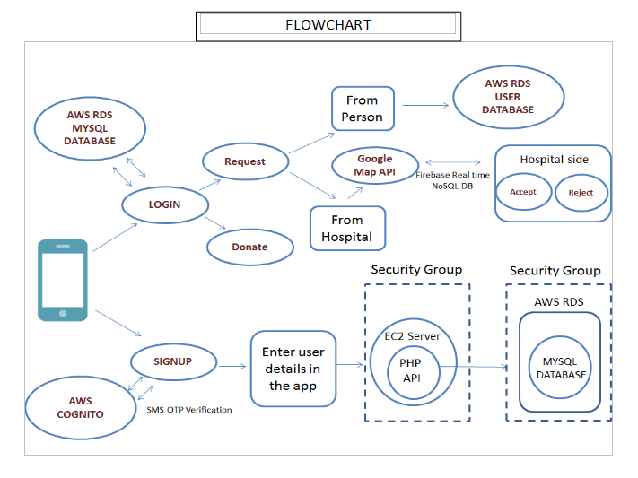

# DonorX

Organ and blood donation is an issue of major concern today. On surveying, we found that in many cases, the lack of availability of the same is not the major challenge. The absence of efficient means of directing blood and organs from donors to recipients is the greater hurdle. Published statistics say that nearly 150,000 patients need kidney transplants annually. But the hospitals manage to get only around 5,000 kidney donors.  The objective is to reduce this gap between donors and recipients. The main project verticals are an Android application, a supporting website, and an SQL database. 

An android application and website will connect the donors and recipients. Users can log in and choose to be a donor. Blood and organ availability of hospitals will also be added to the database. Donors will get an urgent notification if someone in their locality needs their compatible blood group or organ. The required documents will be ready for the organ donor through a link in the app. As donors, they can also donate blood at their nearest blood bank or pledge their organs. When someone is in need of blood or an organ, a person close to him can log in through his cell phone and request for help. He will be connected to the closest donor in his current location. 

